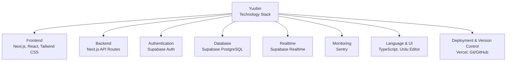
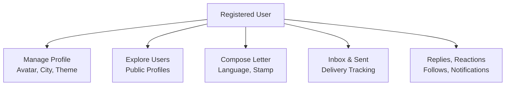
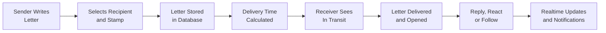
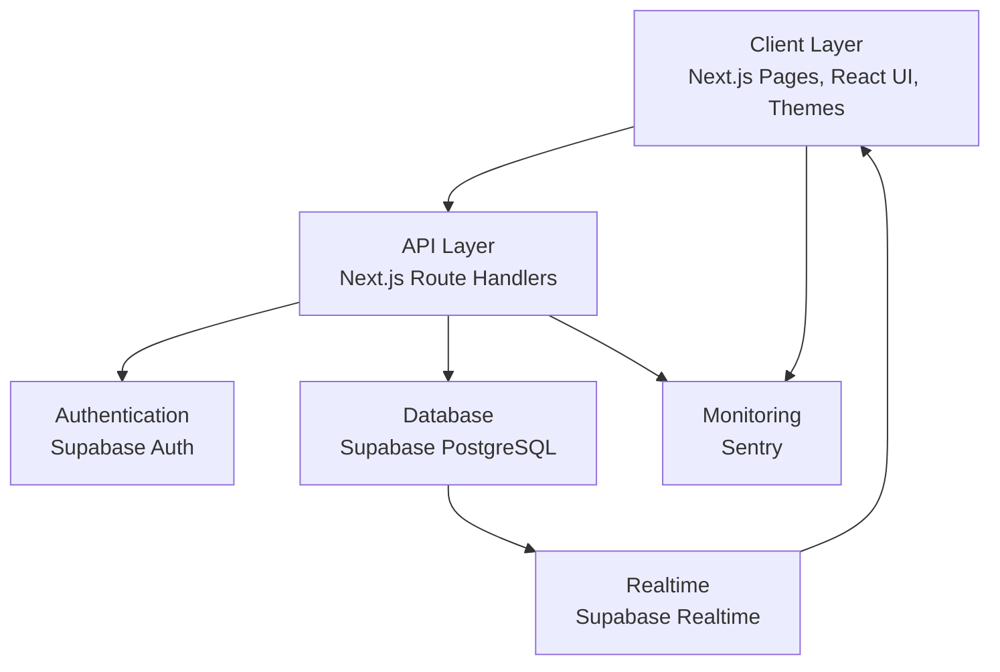
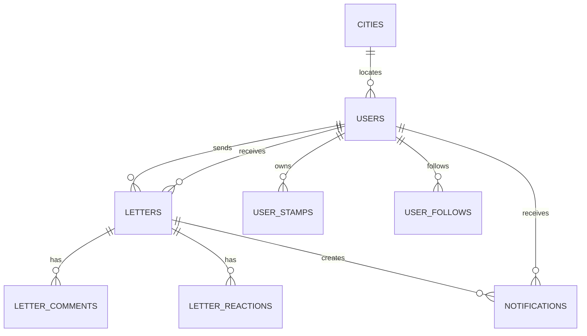
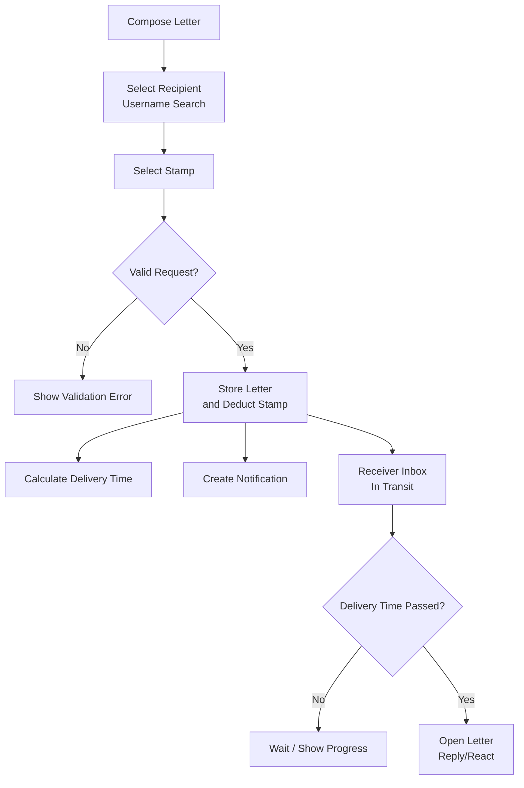

 

## Final Year Project Report

# **Yuubin - A Mindful Digital Letter Exchange Platform**

### **BSCS (Session: 2022--26)**

 

| **Project Supervisor** |  |
|---|---|
| Ms. Maheen Ayesha | Lecturer |
| University of Sahiwal |  |

 

| **Submitted by** |  |
|---|---|
| Nahail Ahmad | BSCS-M2-22-08 |

  

### **Department of Computer Science**
### **University of Sahiwal, Sahiwal**

---

# TABLE OF CONTENTS

- [Preface](#preface)
- [Acknowledgment](#acknowledgment)
- [Certificate of Completion](#certificate-of-completion)
- [Abstract](#abstract)
- [Chapter 1: Introduction](#chapter-1-introduction)
  - [1.1 Goals and Objectives](#11-goals-and-objectives)
  - [1.2 System Statement of Scope](#12-system-statement-of-scope)
  - [1.3 System Context](#13-system-context)
  - [1.4 Theoretical Background](#14-theoretical-background)
  - [1.5 Related Work](#15-related-work)
  - [1.6 Technology & Tools Used](#16-technology--tools-used)
- [Chapter 2: Usage Scenario / User Interaction](#chapter-2-usage-scenario--user-interaction)
  - [2.1 User Profiles](#21-user-profiles)
  - [2.2 Use-Cases](#22-use-cases)
  - [2.3 Special Usage Considerations](#23-special-usage-considerations)
- [Chapter 3: Functional and Data Description](#chapter-3-functional-and-data-description)
  - [3.1 System Architecture](#31-system-architecture)
  - [3.2 Data Description](#32-data-description)
  - [3.3 System Interface Description](#33-system-interface-description)
- [Chapter 4: Subsystem/module Description](#chapter-4-subsystemmodule-description)
  - [4.1 Description for Subsystem `Letter Exchange`](#41-description-for-subsystem-letter-exchange)
- [List of Figures](#list-of-figures)
- [List of Tables](#list-of-tables)
- [References](#references)
- [Glossary](#glossary)

---

# PREFACE

This report presents the design, development, implementation, and testing of **Yuubin**, my Final Year Project. Yuubin is a web-based digital letter exchange platform that modernizes the traditional idea of letter writing by combining it with authentication, profile management, delayed delivery, personalization, realtime updates, email delivery notification, and a gamified stamp collection system.

The idea behind Yuubin came from observing that most digital communication platforms focus on instant replies, short messages, and continuous notifications. Yuubin provides a slower and more thoughtful communication experience where users can compose letters, manage inbox and sent letters, save drafts, personalize themes, explore public profiles, and collect stamps as rewards.

Working on this project helped me gain practical experience in full-stack web development, database design, Supabase authentication, API development, realtime subscriptions, responsive interface design, monitoring, and deployment. This report explains the motivation, scope, design, implementation, testing, limitations, and future direction of Yuubin.

---

# ACKNOWLEDGMENT

First of all, we thank Almighty Allah who gives us the strength and ability to think, work, and deliver what we are assigned to do. Secondly, we must be grateful to our internal supervisor Ms. Maheen Ayesha, who guided us in this project. We also acknowledge our teachers who guided, taught, and helped us during our study period. We would also like to thank all departmental staff and university staff who assisted us during our stay at the university.

---

# CERTIFICATE OF COMPLETION

This is to certify that the following student:

| **Student Name** | **Roll Number** |
|---|---|
| Nahail Ahmad | BSCS-M2-22-08 |

has successfully completed his final year project titled:

> **Yuubin - A Mindful Digital Letter Exchange Platform**

in the partial fulfillment for the requirements of the Degree of Bachelor of Computer Science & Information Technology during the academic session 2022--2026.

  

|  |  |
|---|---|
| ___________________________ | ___________________________ |
| Ms. Maheen Ayesha | Dr. Abdul Hameed |
| Lecturer | Chairperson |
| Department of Computer Science | Department of Computer Science |
| University of Sahiwal | University of Sahiwal |

---

# ABSTRACT

This project presents **Yuubin**, a web-based digital letter exchange platform designed to provide a slower, more thoughtful, and more personalized alternative to instant messaging and fast social media interaction. The system allows users to sign up, log in, manage profiles, compose letters, view inbox and sent letters, save drafts, explore public users, track delayed delivery status, receive notifications, reply to letters, react to conversations, follow users, and collect digital stamps.

The application is developed using Next.js, React, TypeScript, Tailwind CSS, Supabase, and Vercel. Supabase provides authentication, PostgreSQL database storage, realtime subscriptions, and API-backed persistence, while Sentry is used for production error monitoring. Yuubin contributes by combining asynchronous letter-style communication, theme-based personalization, city-based delivery delay, realtime updates, email notification when a letter is delivered, and a gamified stamp collection model into one integrated platform.

The project demonstrates how traditional letter writing can be redesigned for modern digital users while preserving the feeling of patience, expression, and personal connection.

**Keywords:** Digital Letter Exchange, Asynchronous Communication, Supabase, Next.js, Realtime Database, Gamification, Digital Stamps, User Profiles, Serverless Architecture, Sentry Monitoring

---

# Chapter 1: Introduction

This chapter provides an overview of the project titled **Yuubin**, a mindful digital letter exchange platform. It introduces the project goals and objectives, defines the system scope, explains the context in which the system is useful, and presents the theoretical background required to understand the project. The chapter also reviews related work and describes the technologies and tools used during development.

Section 1.1 explains the goals and objectives of Yuubin, including thoughtful letter exchange, profile management, delayed delivery, stamps, realtime updates, and personalization. Section 1.2 defines the system statement of scope by describing the major inputs, processing functionality, and outputs of the system from a black-box perspective. Section 1.3 discusses the system context, target users, and practical relevance of the platform.

The later sections of this chapter provide the theoretical concepts behind online communication, self-disclosure, digital storytelling, gamification, authentication, realtime systems, and serverless architecture. The chapter also summarizes the software tools and technologies used to implement the system.

---

## 1.1 Goals and Objectives

The goal of this project was to develop **Yuubin**, a full-stack web application for meaningful digital letter exchange. Yuubin aims to provide an alternative to fast messaging platforms by creating a postal-inspired environment where users write thoughtful letters, experience delayed delivery, collect stamps, and interact through profiles, replies, reactions, follows, and notifications.

The system uses a serverless full-stack layered architecture based on Next.js App Router and Supabase. The frontend manages user interaction and visual experience, Next.js API routes handle backend logic, and Supabase provides authentication, PostgreSQL storage, realtime database updates, and secure persistence. This architecture reduces the need to maintain a traditional backend server while still supporting secure and dynamic application behavior.

The project also focuses on improving user experience through theme-based interface personalization, Urdu writing support, recipient search by username, public/private profile visibility, realtime notification updates, email notification when a delayed letter is delivered, and a stamp system where selected stamps are transferred between sender and receiver after letter delivery.

The main objectives were to:

- Develop a digital letter exchange workflow with compose, inbox, sent, draft, and detail views.
- Implement user authentication, profile management, public/private profile settings, and avatar customization.
- Provide city-based delayed delivery to simulate the feeling of a travelling letter.
- Support multilingual letter writing, including English and Urdu.
- Implement username-based recipient search without exposing user email addresses.
- Add image-based digital stamps and maintain user stamp inventory.
- Provide realtime updates for inbox, sent letters, notifications, stamps, replies, and reactions.
- Implement email notification when a letter is delivered.
- Implement follow, reply thread, and reaction systems to support social interaction.
- Add production error monitoring using Sentry.
- Build a modular and maintainable system that can support future enhancements.

---

## 1.2 System Statement of Scope

Yuubin was developed as a web-based digital letter exchange platform for thoughtful, delayed, and personalized communication. The system allows users to create accounts, manage profiles, select themes, search recipients by username, write letters, save drafts, send letters with stamps, view inbox and sent letters, track delivery progress, receive delivery email notifications, reply to received letters, react to letters, follow users, and receive in-app notifications.

The major inputs of the system include user signup/login information, profile details, avatar selection, city selection, recipient username, letter subject, letter content, selected language, selected stamp, theme preference, privacy setting, reply content, reaction type, and follow/unfollow actions.

The system processes these inputs by verifying user identity, storing user profiles, validating recipient usernames, calculating delivery delay based on city/country relationship, saving letters and drafts, updating letter delivery status, managing stamp counts, storing replies and reactions, generating notifications, and broadcasting realtime database changes to active clients.

The major outputs include created user profiles, composed letters, saved drafts, sent and received letters, delivery progress indicators, delivered-letter access, delivery email notification, realtime notification updates, updated stamp collections, public explore cards, reply threads, reaction counts, follow status, and user-facing success or error messages.

Overall, Yuubin works as a black-box system where users provide profile information and letter content, while the system manages authentication, data storage, delivery timing, personalization, social features, and realtime updates internally.

---

## 1.3 System Context

Yuubin belongs to the domain of online communication, social web applications, and digital storytelling. It is designed for users who want a more personal and expressive alternative to instant messaging. Instead of focusing on speed, Yuubin focuses on meaningful composition, delayed arrival, identity, personalization, and a postal-inspired experience.

The system is useful for students, friends, communities, pen-pal style networks, writers, language learners, and users who enjoy slower communication. It can be used to write personal letters, reflective messages, event greetings, long-form replies, and multilingual notes.

From a market and social perspective, Yuubin is relevant because modern communication tools often encourage quick responses and short content. Research on online self-disclosure, computer-mediated communication, and digital storytelling shows that online spaces can support expression and connection when designed carefully. Yuubin applies these ideas by creating a focused environment for letter-style communication instead of continuous chat.

Strategically, Yuubin can be positioned as a thoughtful social communication platform that combines traditional letter-writing emotions with modern web technologies such as realtime updates, user profiles, themes, notifications, delivery emails, and gamified stamp collection.

---

## 1.4 Theoretical Background

Yuubin is based on concepts from computer-mediated communication, online self-disclosure, digital storytelling, asynchronous interaction, gamification, authentication, and realtime web systems. Computer-mediated communication explains how people interact through digital systems and how interface design affects expression, trust, and relationship building [1]. Yuubin applies this idea by encouraging slower and more expressive communication through letters.

Self-disclosure is another important concept. Online platforms can influence how much personal information users share and how comfortable they feel while communicating [3]. Yuubin supports this through profile personalization, avatar selection, public/private profile settings, and thoughtful letter composition.

Digital storytelling refers to using digital tools to present personal experiences, ideas, and narratives [5]. Yuubin uses letter writing as a digital storytelling format where users can express longer and more meaningful messages rather than short chat messages.

Gamification is also used in Yuubin through its stamp collection system. Gamification means applying game design elements in non-game contexts to increase engagement and motivation [7]. Yuubin uses collectible stamps, rarity levels, and inventory changes to make letter sending more engaging while staying connected to the postal theme.

The system uses Supabase authentication to verify users and protect private actions. Secure authentication and access control are important for systems that store user-specific data [10], [11], [12]. Yuubin also uses Supabase Realtime, which allows subscribed clients to receive database changes without refreshing the page [13]. This supports live updates for inbox, sent letters, notifications, stamps, replies, and reactions.

---

## 1.5 Related Work

This section reviews prior work and technical references that support the design decisions used in Yuubin. Since Yuubin focuses on meaningful digital communication, delayed interaction, user identity, personalization, gamification, and realtime web behavior, the related work is divided into online communication, self-disclosure and identity, digital storytelling, gamification, authentication, realtime systems, and modern web architecture.

### 1.5.1 Online Communication and Social Interaction

Walther introduced the hyperpersonal model of computer-mediated communication, explaining how digital communication can sometimes become more selective, expressive, and socially meaningful than face-to-face interaction [1]. This work is relevant to Yuubin because the platform is designed around thoughtful digital expression rather than rapid messaging.

Ellison, Steinfield, and Lampe studied the relationship between social network sites and social capital among college students [2]. Their work shows that online platforms can support connection and relationship maintenance. Yuubin applies this concept through profiles, explore cards, follows, replies, and letter exchange.

### 1.5.2 Self-Disclosure, Identity, and Profiles

Joinson studied self-disclosure in computer-mediated communication and found that online environments can affect how users share personal thoughts and information [3]. Yuubin supports controlled self-presentation through avatar selection, profile details, interests, public/private visibility, and theme personalization.

Boyd and Ellison defined social network sites as services that allow users to construct profiles, maintain connections, and view other users within a system [4]. Yuubin includes similar profile and explore concepts but focuses on letter-based communication instead of public posts or feeds.

### 1.5.3 Digital Storytelling and Meaningful Content

Lambert described digital storytelling as a way of using digital tools to express personal stories and experiences [5]. Yuubin follows this idea by treating letters as meaningful digital narratives that can be written, saved, sent, delivered, replied to, and preserved in a personal inbox.

McAdams discussed narrative identity and how people understand themselves through stories [6]. Yuubin supports narrative expression by encouraging users to write longer and more reflective content compared with instant messages.

### 1.5.4 Gamification and Engagement

Deterding et al. introduced gamification as the use of game design elements in non-game contexts [7]. This idea supports Yuubin's stamp collection system, where stamps act as collectible rewards connected to the postal theme.

Hamari, Koivisto, and Sarsa reviewed empirical studies on gamification and found that gamified elements can increase engagement when designed appropriately [8]. Yuubin applies this concept through stamp rarity, collection progress, and stamp transfer between sender and receiver.

### 1.5.5 Authentication, Security, and Privacy

The NIST Digital Identity Guidelines provide recommendations for authentication and lifecycle management [10]. Yuubin applies authentication through Supabase Auth, password reset, session handling, and protected API routes.

OWASP authentication guidance explains secure practices for login systems, password handling, and session protection [11]. OWASP access control guidance explains that users should not access resources outside their permissions [12]. These principles are relevant to Yuubin because users should only access their own letters, profiles, stamps, and private data.

### 1.5.6 Realtime and Serverless Web Architecture

Jonas et al. discussed serverless computing as a cloud programming model that reduces the need to manage always-running infrastructure [9]. Yuubin follows a serverless full-stack architecture where Next.js API routes handle backend logic and Supabase provides managed authentication and database services.

Supabase Realtime documentation describes how applications can listen to PostgreSQL database changes and update connected clients live [13]. Yuubin uses this capability for inbox, sent letters, notifications, stamps, replies, and reactions.

Next.js documentation describes the App Router and route handlers used for modern full-stack React applications [14]. Yuubin uses Next.js pages for the frontend and Next.js API routes for backend logic.

---

## 1.6 Technology & Tools Used

This section presents the major technologies and tools used to develop **Yuubin**. The project was completely software-based; therefore, no hardware components or hardware datasheets were required. The selected technologies supported user authentication, database management, API development, realtime updates, responsive frontend design, monitoring, version control, and deployment.

**Figure 1.1:** Technology and Tools Used in Yuubin

The frontend interface is built with **Next.js**, **React**, **TypeScript**, and **Tailwind CSS**. Backend functionality is implemented through **Next.js API Routes**, while **Supabase Auth** handles authentication and **Supabase PostgreSQL** stores users, letters, cities, stamps, notifications, follows, replies, and reactions.

**Supabase Realtime** is used to update active clients when important database changes occur. **Sentry** is integrated for production error monitoring and diagnostics. Deployment and version control are supported by **Vercel**, **Git**, and **GitHub**.

---

# Chapter 2: Usage Scenario / User Interaction

This chapter explains how different users interact with **Yuubin**. It describes the main user profiles, important use-cases, and special usage considerations that affect the behavior of the system. Since Yuubin is designed as a digital letter exchange platform, user interaction is centered around thoughtful writing, profile discovery, delayed delivery, stamps, notifications, and realtime updates.

---

## 2.1 User Profiles

Yuubin supports different types of users based on how they interact with the system. The primary user is a registered user who creates an account through Supabase authentication and manages a personal profile. This user can update profile information, select an avatar, choose a city, set profile visibility, select a theme, write letters, send stamps, receive letters, and interact with other users.

Another important profile is the sender. A sender writes a letter, selects the recipient by username, chooses the letter language, attaches a stamp, and sends the letter. The sender can view sent letters, track delivery progress, delete letters, and see whether the letter has reached the receiver.

The receiver is the user who receives the letter. The receiver can view incoming letters in the inbox, track whether a letter is pending, in transit, or delivered, open the letter after delivery, reply to the letter, react to it, and receive in-app or email notifications when important events occur.

Yuubin also supports public users in the Explore page. Users who set their profile to public can be discovered by others. Their profile card may show username, avatar, interests, city, and a button to write a letter. Users who set their profile to private are not shown in Explore.

**Figure 2.1:** User Profile and Interaction Overview in Yuubin

---

## 2.2 Use-Cases

The main use-case of Yuubin is sending a thoughtful digital letter. In this use-case, the user logs in, opens the compose page, selects the letter language, searches for a recipient by username, writes the subject and content, selects a stamp, and sends the letter. The system stores the letter, calculates delayed delivery time, updates stamp inventory, and shows the letter in the sender's sent list and receiver's inbox.

Another use-case is receiving and opening a delayed letter. The receiver sees the incoming letter in the inbox with a delivery progress bar. If the letter is still in transit, the content remains sealed. When the delivery time passes, the letter becomes available, and the user can open it. The system also supports realtime updates so the receiver does not need to refresh the page manually.

The system also supports draft saving. A user can write a letter and save it as a draft before sending. This allows users to continue editing later without losing their work.

Profile discovery is another use-case. A user can open the Explore page to find public users, view their basic profile information, follow them, or start writing a letter. This supports social discovery without exposing private email addresses.

Yuubin also supports reply and reaction use-cases. After a delivered letter is opened, users can continue the conversation through nested replies and reactions. These updates are shown in realtime so both sender and receiver can see interaction changes without refreshing the page.

**Figure 2.2:** Letter Sending and Delivery Use-case Flow

---

## 2.3 Special Usage Considerations

Yuubin includes several special considerations to make the system secure, usable, and aligned with its project concept. First, a user cannot send a letter to himself, and the recipient search does not show the logged-in user. This prevents meaningless self-delivery and keeps the recipient workflow clear.

Second, recipient search is based on username rather than email. This protects user privacy because email addresses are not exposed during the letter-sending process. Users are identified publicly through usernames and avatars.

Third, delayed delivery is an important part of the system. Letters may appear in the receiver's inbox before they can be opened. This is intentional because Yuubin is designed to give the feeling that a letter is travelling toward the receiver. The progress bar and delivery status explain this state visually.

Fourth, multilingual writing requires interface adjustments. Urdu letters are displayed with right-to-left direction and Urdu-friendly font handling, while English letters use left-to-right layout. This ensures that the preview and final delivered letter remain readable.

Fifth, realtime behavior depends on Supabase Realtime publications. Tables such as letters, notifications, user stamps, letter comments, and letter reactions must be enabled in the Supabase realtime publication so users can receive live updates.

Finally, monitoring and error tracking are handled through Sentry. This helps identify frontend and backend issues after deployment and improves the reliability of the application during real usage.

---

# Chapter 3: Functional and Data Description

This chapter describes the functional structure and data design of **Yuubin**. It explains the system architecture, major subsystems, important data objects, system-level data model, and external interfaces used by the application.

---

## 3.1 System Architecture

Yuubin follows a **serverless full-stack layered architecture**. The frontend layer is built with Next.js, React, TypeScript, and Tailwind CSS. The backend layer is implemented through Next.js API routes, which handle business logic such as profile lookup, letter sending, delivery synchronization, notifications, replies, reactions, follows, and stamp inventory updates.

### 3.1.1 Architecture Model

The architecture model separates user interface, backend logic, authentication, database storage, realtime updates, and monitoring. The browser handles interface rendering, local interaction, form input, theme selection, and progress display. Next.js API routes handle secure operations and communicate with Supabase. Supabase stores persistent data and broadcasts changes to subscribed clients. Sentry captures production errors for frontend and backend monitoring.

**Figure 3.1:** Yuubin Serverless Full-Stack Architecture

### 3.1.2 Subsystem/modules overview

| **Module** | **Description** |
|---|---|
| Authentication Module | Handles signup, login, logout, password reset, session management, and hCaptcha support using Supabase Auth. |
| Profile Module | Manages user profile data including username, full name, avatar, bio, interests, city, theme, and public/private visibility. |
| Compose Module | Allows users to write letters, select language, choose recipient username, select stamp, save drafts, and send letters. |
| Delivery Module | Calculates delayed delivery time, tracks progress, updates delivered status, and controls when letter content can be opened. |
| Inbox/Sent Module | Displays received and sent letters with status, progress, search, filters, and realtime refresh. |
| Stamp Module | Maintains local stamp catalogue and user stamp inventory, including stamp decrement for sender and increment for receiver. |
| Explore Module | Shows public user profiles and allows users to follow or write letters to discovered users. |
| Reply and Reaction Module | Supports nested replies, reaction counts, and realtime updates on delivered letters. |
| Notification Module | Shows in-app notifications, browser popups, toast messages, and email notification when a letter is delivered. |
| Monitoring Module | Uses Sentry to capture frontend, backend, and API route errors in production. |

---

## 3.2 Data Description

Yuubin stores structured data in Supabase PostgreSQL. The data model is centered around users and letters. Other tables support delivery tracking, notifications, stamps, replies, reactions, follows, and city information. Static stamp images and avatar images are stored in the project public folder, while database records store identifiers and counts.

### 3.2.1 Major data objects

| **Data Object** | **Description** |
|---|---|
| User | Stores account-related profile information such as email, username, full name, avatar, bio, interests, city, theme, and visibility. |
| Letter | Stores subject, content, sender, recipient, language, status, stamp ID, delivery time, read state, and timestamps. |
| City | Stores city, country, coordinates, and country codes used for user location and delivery calculation. |
| Stamp | Represents the static stamp catalogue used by the application. User inventory stores stamp IDs and counts. |
| User Stamp | Stores which stamps a user owns and how many copies are available. |
| Notification | Stores user notifications related to delivered letters, replies, and important activity. |
| Letter Comment | Stores replies on delivered letters, including nested reply relationship through parent comment ID. |
| Letter Reaction | Stores reaction type selected by users for a letter. |
| User Follow | Stores follower and following relationships between users. |
| Theme Settings | Stores or applies selected visual style such as Modern, Night, or Vintage. |

### 3.2.2 System level data model

At the system level, a user can send many letters and receive many letters. Each letter belongs to one sender and one receiver. A letter may have one selected stamp, multiple replies, multiple reactions, and multiple notifications related to it. Users can follow other users, own many stamps, and receive many notifications.

**Figure 3.2:** System Level Data Model of Yuubin

---

## 3.3 System Interface Description

This section describes the external interfaces used by Yuubin. Since the project is a web-based software system, the main interfaces are browser interface, database service interface, authentication interface, realtime interface, monitoring interface, deployment interface, and email-related notification interface.

### 3.3.1 External machine interfaces

Yuubin does not require any dedicated hardware or machine-level devices. The system runs through a web browser on laptops, desktops, tablets, or mobile browsers. Users interact with the application through standard input devices such as keyboard, mouse, and touch screen.

The application is deployed through Vercel, which provides the hosting environment for the Next.js application. Supabase provides managed database, authentication, and realtime services. These services communicate through HTTPS APIs and secure environment variables.

### 3.3.2 External system interfaces

Yuubin communicates with several external software systems. Supabase Auth is used for authentication and session management. Supabase PostgreSQL is used for persistent data storage. Supabase Realtime is used to receive live database updates. Sentry is used for error monitoring and diagnostics. Vercel is used for deployment and hosting. Email notification support is used to notify users when a delayed letter is delivered.

| **External System** | **Purpose in Yuubin** |
|---|---|
| Supabase Auth | Provides signup, login, logout, password reset, hCaptcha support, and session validation. |
| Supabase PostgreSQL | Stores users, letters, cities, stamps, notifications, follows, replies, and reactions. |
| Supabase Realtime | Sends database change events to active clients for live UI updates. |
| Vercel | Hosts the Next.js application and runs serverless API routes. |
| Sentry | Captures frontend, backend, and API route errors for production monitoring. |
| Email Service / Supabase Email | Sends account-related emails and delivery-related notifications. |
| GitHub | Stores source code, supports version control, and enables project collaboration. |

---

# Chapter 4: Subsystem/module Description

This chapter describes one of the most important subsystems of **Yuubin**: the **Letter Exchange Subsystem**. This subsystem controls the complete letter workflow from composition to delivery, including recipient selection, stamp selection, delayed delivery calculation, inbox/sent updates, replies, reactions, and notifications.

---

## 4.1 Description for Subsystem `Letter Exchange`

The Letter Exchange Subsystem is the core functional subsystem of Yuubin. It connects the compose page, recipient search, stamps, delivery calculation, database storage, notification generation, and letter detail view. Its purpose is to allow users to write meaningful letters and deliver them with a controlled delay instead of instant message delivery.

### 4.1.1 Subsystem scope

The scope of the Letter Exchange Subsystem includes creating letters, saving drafts, sending letters, selecting recipients by username, attaching stamps, calculating delivery time, storing letter records, showing delivery progress, opening delivered letters, and supporting replies and reactions after delivery.

This subsystem does not directly handle user account creation, city dataset import, global theme setup, or production monitoring configuration. However, it depends on the authentication subsystem, profile subsystem, stamp subsystem, notification subsystem, and realtime subsystem to complete the full user experience.

### 4.1.2 Subsystem flow diagram/desired UML diagram

**Figure 4.1:** Letter Exchange Subsystem Flow Diagram

### 4.1.3 Subsystem `Letter Exchange` components

| **Component** | **Description** |
|---|---|
| Compose Interface | Provides fields for recipient username, language, subject, content, stamp selection, draft saving, and letter sending. |
| Recipient Search | Searches users by username and returns matching public identity information without exposing email addresses. |
| Delivery Calculator | Calculates estimated delivery time based on sender and receiver city/country relationship. |
| Letter API | Stores letters, updates delivery status, deletes letters, syncs delivered letters, and retrieves letter details. |
| Stamp Inventory Handler | Decreases selected stamp count from sender and increases receiver stamp count when letter workflow is completed. |
| Notification Handler | Creates in-app and delivery-related notifications when letter events occur. |
| Realtime Listener | Refreshes inbox, sent letters, notifications, replies, and reactions when database changes occur. |
| Letter Viewer | Displays sealed in-transit letters and opens delivered letters with reply and reaction options. |

### 4.1.4 Description for sub system `Letter Exchange` Component `Letter API`

The Letter API component is responsible for the backend operations of the Letter Exchange Subsystem. It receives requests from the frontend, verifies the user session, validates sender and receiver information, stores letter data, updates delivery status, and returns structured responses to the client. It also protects access so that only the sender or receiver can view a letter.

#### 4.1.4.1 Component `Letter API` interface description

| **Interface** | **Purpose** |
|---|---|
| GET /api/letters | Retrieves inbox, sent, or draft letters for a specific authenticated user. |
| POST /api/letters | Creates or sends a new letter after validating recipient, content, city, and stamp information. |
| PATCH /api/letters | Synchronizes delivery status for letters whose delivery time has passed. |
| GET /api/letters/[id] | Retrieves details of a specific letter if the logged-in user has permission. |
| DELETE /api/letters/[id] | Deletes a letter from the user's view according to access rules. |
| GET /api/letters/[id]/replies | Retrieves replies attached to a delivered letter. |
| POST /api/letters/[id]/replies | Adds a reply or nested reply to a delivered letter. |
| GET /api/letters/[id]/reactions | Retrieves reaction counts for a letter. |
| POST /api/letters/[id]/reactions | Toggles a reaction for the authenticated user. |

#### 4.1.4.2 Restrictions/limitations

The Letter Exchange Subsystem has some restrictions. A user cannot send a letter to himself. Recipient search is based only on username to protect email privacy. A receiver cannot open a letter until the delivery time has passed. Realtime updates require the related Supabase tables to be included in the realtime publication. The system also depends on valid city information for accurate delivery calculation.

#### 4.1.4.3 Performance issues

Performance depends on API response time, Supabase query speed, realtime connection stability, and frontend rendering. Letter progress is time-based and updates through a timer, while database changes are handled through realtime subscriptions. Large numbers of letters, replies, or notifications may require pagination or optimized database indexes in future versions.

#### 4.1.4.4 Design constraints

The subsystem was designed according to the postal theme of Yuubin. Therefore, letters are intentionally delayed instead of being delivered instantly. The UI must support both English and Urdu text direction. The system must protect user privacy by avoiding email exposure in recipient search. It must also keep stamp inventory consistent when letters are sent and received. Since the application uses a serverless deployment model, backend logic must remain suitable for Next.js API routes and managed Supabase services.

---

# LIST OF FIGURES

| Figure No. | Title |
|---|---|
| Figure 1.1 | Technology and Tools Used in Yuubin |
| Figure 2.1 | User Profile and Interaction Overview in Yuubin |
| Figure 2.2 | Letter Sending and Delivery Use-case Flow |
| Figure 3.1 | Yuubin Serverless Full-Stack Architecture |
| Figure 3.2 | System Level Data Model of Yuubin |
| Figure 4.1 | Letter Exchange Subsystem Flow Diagram |

---

# LIST OF TABLES

| Table No. | Title |
|---|---|
| Table 1 | Certificate Student Information |
| Table 2 | Yuubin Subsystem and Module Overview |
| Table 3 | Major Data Objects in Yuubin |
| Table 4 | External System Interfaces |
| Table 5 | Letter Exchange Subsystem Components |
| Table 6 | Letter API Interface Description |
| Table 7 | Glossary of Terms |

---

# REFERENCES

[1] J. B. Walther, "Computer-mediated communication: Impersonal, interpersonal, and hyperpersonal interaction," *Communication Research*, vol. 23, no. 1, pp. 3--43, 1996. Available: <https://doi.org/10.1177/009365096023001001>

[2] N. B. Ellison, C. Steinfield, and C. Lampe, "The Benefits of Facebook Friends: Social Capital and College Students' Use of Online Social Network Sites," *Journal of Computer-Mediated Communication*, vol. 12, no. 4, pp. 1143--1168, 2007. Available: <https://doi.org/10.1111/j.1083-6101.2007.00367.x>

[3] A. N. Joinson, "Self-disclosure in computer-mediated communication: The role of self-awareness and visual anonymity," *European Journal of Social Psychology*, vol. 31, no. 2, pp. 177--192, 2001. Available: <https://doi.org/10.1002/ejsp.36>

[4] D. M. Boyd and N. B. Ellison, "Social Network Sites: Definition, History, and Scholarship," *Journal of Computer-Mediated Communication*, vol. 13, no. 1, pp. 210--230, 2007. Available: <https://doi.org/10.1111/j.1083-6101.2007.00393.x>

[5] J. Lambert, *Digital Storytelling: Capturing Lives, Creating Community*. New York, NY, USA: Routledge, 2013. Available: <https://www.routledge.com/Digital-Storytelling-Capturing-Lives-Creating-Community/Lambert/p/book/9780415627030>

[6] D. P. McAdams, "The Psychology of Life Stories," *Review of General Psychology*, vol. 5, no. 2, pp. 100--122, 2001. Available: <https://doi.org/10.1037/1089-2680.5.2.100>

[7] S. Deterding, D. Dixon, R. Khaled, and L. Nacke, "From game design elements to gamefulness: defining gamification," in *Proc. 15th International Academic MindTrek Conference*, 2011, pp. 9--15. Available: <https://doi.org/10.1145/2181037.2181040>

[8] J. Hamari, J. Koivisto, and H. Sarsa, "Does Gamification Work? A Literature Review of Empirical Studies on Gamification," in *Proc. 47th Hawaii International Conference on System Sciences*, 2014, pp. 3025--3034. Available: <https://doi.org/10.1109/HICSS.2014.377>

[9] E. Jonas et al., "Cloud Programming Simplified: A Berkeley View on Serverless Computing," *arXiv preprint arXiv:1902.03383*, 2019. Available: <https://arxiv.org/abs/1902.03383>

[10] National Institute of Standards and Technology, "Digital Identity Guidelines: Authentication and Lifecycle Management," NIST Special Publication 800-63B. Available: <https://pages.nist.gov/800-63-4/sp800-63b.html>

[11] OWASP Foundation, "Authentication Cheat Sheet," OWASP Cheat Sheet Series. Available: <https://cheatsheetseries.owasp.org/cheatsheets/Authentication_Cheat_Sheet.html>

[12] OWASP Foundation, "Access Control," OWASP Web Security Resources. Available: <https://owasp.org/www-community/Access_Control>

[13] Supabase, "Realtime," Supabase Documentation. Available: <https://supabase.com/docs/guides/realtime>

[14] Vercel, "Next.js Documentation," Next.js Official Documentation. Available: <https://nextjs.org/docs>

---

# GLOSSARY

| **Term** | **Meaning** |
|---|---|
| API | Application Programming Interface; a set of endpoints used by the frontend to communicate with backend logic. |
| Asynchronous Communication | Communication where sender and receiver do not need to interact at the same time. |
| Authentication | The process of verifying the identity of a user before allowing access to protected features. |
| Avatar | A visual representation selected by a user for their profile. |
| Delayed Delivery | A letter delivery model where the message becomes available after a calculated time delay. |
| Digital Stamp | A collectible image-based stamp used while sending a letter. |
| Draft | A saved letter that has not yet been sent. |
| Email Notification | A message sent to inform the receiver that a delayed letter has arrived or is available. |
| Explore | A public profile discovery page where users can find other public users. |
| Gamification | The use of game-like elements such as stamps, rarity, and collection progress in a non-game system. |
| Inbox | A page where received letters and their delivery status are displayed. |
| Realtime Database | A database feature that sends live updates to subscribed clients when data changes. |
| Sentry | An error monitoring service used to capture frontend and backend application errors. |
| Serverless Architecture | A design where backend logic runs through managed functions or route handlers instead of a manually maintained server. |
| Supabase | A backend-as-a-service platform used for authentication, PostgreSQL database, and realtime updates. |
| Theme | A visual style option that changes colors, logo, and interface appearance. |
| Yuubin | The project name for the digital letter exchange platform. |

---

**End of Report**

